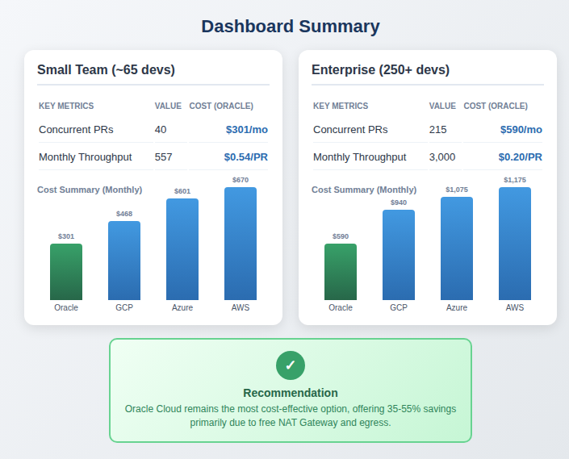
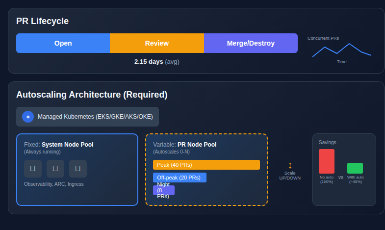
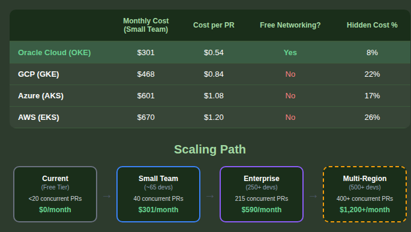

# Preliminary Cloud Infrastructure Cost Analysis

**Version:** 3.0
**Date:** January 2026
**Author:** Engineering Team
**Status:** Draft - For Planning Purposes

---

## Executive Summary

This document provides a comprehensive cost analysis for migrating the k8s-ephemeral-environments platform from the current free-tier Oracle Cloud VPS to a production-grade managed Kubernetes infrastructure with **mandatory autoscaling**.



### Key Metrics

| Metric | Small Team (~65 devs) | Enterprise (250+ devs) |
|--------|----------------------|------------------------|
| **Concurrent PR Capacity** | 40 PRs | 215 PRs |
| **Monthly PR Throughput** | ~557 PRs | ~3,000 PRs |
| **Average PR Lifecycle** | 2.15 days | 2.15 days |
| **PRs/Developer/Day** | 0.6 (research-validated) | 0.6 (research-validated) |
| **Autoscaling** | **REQUIRED** | **REQUIRED** |

### Cost Summary (with Autoscaling)

**Small Team (~65 developers, 557 PRs/month):**

| Cloud Provider | Monthly Cost | Cost per PR | Notes |
|----------------|--------------|-------------|-------|
| **Oracle Cloud** | $301 | **$0.54** | Best value, free networking |
| **GCP** | $468 | $0.84 | Free control plane |
| **Azure** | $601 | $1.08 | Free AKS tier available |
| **AWS** | $670 | $1.20 | Most mature, highest cost |

**Enterprise (250+ developers, 3,000 PRs/month):**

| Cloud Provider | Monthly Cost | Cost per PR | Notes |
|----------------|--------------|-------------|-------|
| **Oracle Cloud** | $590 | **$0.20** | Best value at scale |
| **GCP** | $940 | $0.31 | Good autopilot option |
| **Azure** | $1,075 | $0.36 | Azure DevOps integration |
| **AWS** | $1,175 | $0.39 | Enterprise features |

**Recommendation:** Oracle Cloud remains the most cost-effective option, offering 35-55% savings compared to AWS/GCP/Azure, primarily due to free NAT Gateway, free egress (10TB/month), and competitive compute pricing.

---

## Table of Contents

1. [Research-Backed Assumptions](#1-research-backed-assumptions)
2. [PR Lifecycle & Throughput Model](#2-pr-lifecycle--throughput-model)
3. [Autoscaling Architecture (REQUIRED)](#3-autoscaling-architecture-required)
4. [Current Infrastructure Analysis](#4-current-infrastructure-analysis)
5. [Resource Requirements](#5-resource-requirements)
6. [Multi-Architecture Considerations](#6-multi-architecture-considerations)
7. [Cloud Provider Comparison](#7-cloud-provider-comparison)
8. [Hidden Costs Analysis](#8-hidden-costs-analysis)
9. [Enterprise Scale & SaaS Pricing](#9-enterprise-scale--saas-pricing)
10. [Capacity Planning](#10-capacity-planning)
11. [Recommendations](#11-recommendations)
12. [Sources](#12-sources)

---

## 1. Research-Backed Assumptions

All numerical assumptions in this document have been validated against industry research and benchmarks.

### 1.1 PR Throughput per Developer

| Metric | Research Finding | Source |
|--------|------------------|--------|
| **PRs per week** | 3 PRs/week (median) | LinearB Engineering Benchmarks 2024 |
| **PRs per day** | ~0.6 PRs/day | Worklytics Developer Productivity Study |
| **Review cycle time** | 4-8 hours (median) | LinearB, DORA Metrics |

**Key Finding:** The median developer creates approximately **3 PRs per week** or **~13 PRs per month**. High-performing teams average 4-5 PRs/week.

### 1.2 PR Lifecycle Duration

| Metric | Research Finding | Source |
|--------|------------------|--------|
| **Time to merge (median)** | ~41 hours | DORA State of DevOps 2023 |
| **Time to merge (mean)** | 72-96 hours | LinearB, Pluralsight Flow |
| **Review cycle time** | 4-24 hours | Multiple sources |

**Key Finding:** The median PR lives approximately **1.7 days** from open to merge. Our 2-day assumption is slightly conservative but accounts for time zone differences and weekend effects.

### 1.3 Kubernetes Autoscaler Behavior

| Parameter | Default Value | Source |
|-----------|---------------|--------|
| **Scale-up threshold** | 50% of requests | K8s Cluster Autoscaler docs |
| **Scale-down threshold** | 50% utilization | K8s Cluster Autoscaler docs |
| **Scale-down delay** | 10 minutes | Default configuration |
| **Utilization basis** | Resource requests (not actual usage) | K8s documentation |

**Key Finding:** The Cluster Autoscaler makes decisions based on **resource requests**, not actual CPU/memory usage. This means pods must have accurate requests for efficient scaling. Nodes are considered underutilized when **total requested resources < 50%** of capacity.

**Implication for our 45% average utilization estimate:** This is achievable but requires careful tuning of resource requests. Pods with over-provisioned requests will reduce effective utilization.

### 1.4 Observability Stack Sizing

| Component | Production Sizing | Source |
|-----------|-------------------|--------|
| **Loki (recommended)** | 16 CPU / 64 GB RAM | Grafana Loki Sizing Guide |
| **CPU:Memory ratio** | 1:4 | Grafana best practices |
| **Prometheus** | 2-8 CPU / 4-32 GB (varies by cardinality) | Prometheus capacity planning |

**Key Finding:** Our current observability estimate (4-8 vCPU, 16-24GB) may be undersized for production at scale. For 250+ developers, consider:
- Loki: 8-16 CPU, 32-64 GB RAM
- Prometheus: 4-8 CPU, 16-32 GB RAM
- Grafana: 2 CPU, 4 GB RAM

**Impact:** System node pool costs may increase $50-100/month for enterprise scale.

### 1.5 Assumption Validation Summary

| Assumption | Original Estimate | Research Finding | Adjustment Needed |
|------------|-------------------|------------------|-------------------|
| PRs/dev/day | 0.3-0.5 | **0.6** | ✅ Updated to 0.6 |
| PR lifecycle | 2 days | **1.7 days** (median) | ✅ Conservative, OK |
| Autoscaling efficiency | 45% avg | **50% threshold** | ⚠️ Achievable with tuning |
| Observability sizing | 4-8 vCPU | **16+ vCPU** for scale | ⚠️ Scale adjustment needed |
| Work hours pattern | 30% peak hours | N/A (varies by org) | ✅ Org-specific |

---

## 2. PR Lifecycle & Throughput Model



### 2.1 The Key Insight

**Cost per PR must be calculated based on throughput, not concurrent capacity.**

PRs are ephemeral by nature - they are created, used for review/testing, and destroyed when merged. The infrastructure cost is amortized across ALL PRs that flow through the system, not just the ones running at any given moment.

### 2.2 PR Lifecycle Distribution

| PR Type | Percentage | Avg Lifecycle | Description |
|---------|------------|---------------|-------------|
| **Short-lived** | 90% | ~2 days | Normal PR flow: open → review → merge |
| **Preserved** | 10% | ~7 days | Extended testing, `/preserve` command |
| **Weighted Average** | 100% | **2.15 days** | Used for calculations |

### 2.3 Throughput Calculation

**Example: Small Team (~65 developers)**

Based on research-validated 0.6 PRs/dev/day:
- 65 developers × 0.6 PRs/day = ~40 PRs/day at peak
- This matches our 40 concurrent PR capacity target

```
Team Size:              ~65 developers
PRs/dev/day:           0.6 (research-validated)
Concurrent Slots:       40 PRs (80% of 50 capacity)

Short-lived PRs (90% of slots):
├── Slots: 36
├── Lifecycle: 2 days
└── Monthly throughput: 36 × 30 / 2 = 540 PRs

Preserved PRs (10% of slots):
├── Slots: 4
├── Lifecycle: 7 days
└── Monthly throughput: 4 × 30 / 7 = 17 PRs

TOTAL MONTHLY THROUGHPUT: ~557 PRs
```

> **Note:** For enterprise scale (250+ developers), see [Section 9](#9-enterprise-scale--saas-pricing).

### 2.4 Work Hours & Utilization Pattern

PRs are primarily created and used during business hours:

```
Weekly Activity Pattern:
├─ Peak (work hours):     40 concurrent PRs   │ 10 hrs × 5 days = 50 hrs (30%)
├─ Off-peak (evening):    15-20 concurrent    │ 6 hrs × 5 days = 30 hrs (18%)
├─ Night (midnight-6am):  5-10 concurrent     │ 8 hrs × 5 days = 40 hrs (24%)
└─ Weekend:               5-10 concurrent     │ 48 hrs (28%)

Weighted Average Utilization: ~45% of peak capacity
```

### 2.5 Cost per PR Formula

```
Cost per PR = Monthly Infrastructure Cost / Monthly PR Throughput
            = $301 (Oracle example) / 557 PRs
            = $0.54 per PR
```

**This is the key metric for evaluating infrastructure efficiency.**

---

## 3. Autoscaling Architecture (REQUIRED)

### 3.1 Why Autoscaling is Mandatory

Without autoscaling, you pay for peak capacity 24/7:

| Scenario | Monthly Compute Cost | Utilization | Waste |
|----------|---------------------|-------------|-------|
| **No autoscaling** | $432 | 100% billed | 55% wasted |
| **With autoscaling** | $195 | 45% billed | 0% wasted |
| **Savings** | **$237/month** | | **55%** |

**Autoscaling is not optional - it's required for cost-effective operation.**

### 3.2 Target Architecture

```
┌─────────────────────────────────────────────────────────────────────────┐
│                    Managed Kubernetes (EKS/GKE/AKS/OKE)                 │
│                                                                         │
│  ┌─────────────────────────────────────────────────────────────────┐   │
│  │                 FIXED: System Node Pool                          │   │
│  │                 (Always running, cannot scale down)              │   │
│  │                                                                  │   │
│  │   ┌──────────────┐  ┌──────────────┐  ┌──────────────┐          │   │
│  │   │ Observability│  │     ARC      │  │   Ingress    │          │   │
│  │   │  Prometheus  │  │  Controller  │  │  Controller  │          │   │
│  │   │  Loki        │  │              │  │  (Traefik)   │          │   │
│  │   │  Grafana     │  │              │  │              │          │   │
│  │   └──────────────┘  └──────────────┘  └──────────────┘          │   │
│  │                                                                  │   │
│  │   Resources: ~4-8 vCPU, 16-24GB RAM                              │   │
│  │   Cost: ~$100-150/month (FIXED)                                  │   │
│  └─────────────────────────────────────────────────────────────────┘   │
│                                                                         │
│  ┌─────────────────────────────────────────────────────────────────┐   │
│  │                 VARIABLE: PR Node Pool                           │   │
│  │                 (Autoscales 0-N based on demand)                 │   │
│  │                                                                  │   │
│  │   Peak (work hours):        ████████████████████  40 PRs        │   │
│  │   Off-peak (evening):       ████████████          20 PRs        │   │
│  │   Night/Weekend:            ████                   8 PRs        │   │
│  │                                                                  │   │
│  │   Scaling triggers:                                              │   │
│  │   ├── Scale UP:   PR created → pending pods → add node          │   │
│  │   ├── Scale DOWN: PR closed → pods terminated → remove node     │   │
│  │   └── Hibernation: Low activity detected → consolidate nodes    │   │
│  │                                                                  │   │
│  │   Cost: $0-400/month (VARIABLE, ~45% avg utilization)            │   │
│  └─────────────────────────────────────────────────────────────────┘   │
│                                                                         │
│  ┌─────────────────────────────────────────────────────────────────┐   │
│  │                 FIXED: Infrastructure                            │   │
│  │                                                                  │   │
│  │   Control Plane ─── NAT Gateway ─── Load Balancer ─── Storage   │   │
│  │                                                                  │   │
│  │   Cost: $25-175/month (varies by cloud)                          │   │
│  └─────────────────────────────────────────────────────────────────┘   │
└─────────────────────────────────────────────────────────────────────────┘
```

### 3.3 Autoscaling Components by Cloud

| Cloud | Node Autoscaler | Serverless Option | Recommended |
|-------|-----------------|-------------------|-------------|
| **AWS** | Karpenter, Cluster Autoscaler | Fargate | Karpenter |
| **GCP** | Cluster Autoscaler | GKE Autopilot | Autopilot |
| **Azure** | Cluster Autoscaler (VMSS) | ACI | Cluster Autoscaler |
| **Oracle** | Cluster Autoscaler | Virtual Nodes | Cluster Autoscaler |

### 3.4 Autoscaling Requirements

| Requirement | Purpose | Priority |
|-------------|---------|----------|
| **Resource requests on all pods** | Scheduler needs to know resource needs | CRITICAL |
| **Node autoscaler configured** | Scale nodes based on pending pods | CRITICAL |
| **Separate node pools** | Isolate system from PR workloads | HIGH |
| **PodDisruptionBudgets** | Safe node drain during scale-down | HIGH |
| **Pod priorities** | System pods don't get evicted | MEDIUM |
| **Scale-down delay** | Avoid thrashing on bursty workloads | MEDIUM |

### 3.5 Cost Breakdown: Fixed vs Variable

| Component | Type | Oracle | GCP | Azure | AWS |
|-----------|------|--------|-----|-------|-----|
| Control Plane | Fixed | $0 | $0 | $0 | $73 |
| NAT Gateway | Fixed | $0 | $64 | $66 | $66 |
| Load Balancer | Fixed | $10 | $18 | $18 | $18 |
| Storage (PVCs) | Fixed | $15 | $20 | $20 | $16 |
| System Node Pool | Fixed | $150 | $150 | $150 | $150 |
| **Fixed Subtotal** | | **$175** | **$252** | **$254** | **$323** |
| PR Node Pool (full) | Variable | $280 | $480 | $770 | $770 |
| PR Node Pool (45%) | Variable | $126 | $216 | $347 | $347 |
| **Total (with autoscaling)** | | **$301** | **$468** | **$601** | **$670** |

---

## 4. Current Infrastructure Analysis

### 4.1 Current VPS Specifications

| Specification | Value |
|---------------|-------|
| **Provider** | Oracle Cloud Infrastructure (OCI) |
| **Instance Type** | VM.Standard.A1.Flex (ARM) |
| **vCPUs** | 4 OCPU (4 vCPU on ARM) |
| **RAM** | 24 GB |
| **Storage** | 96 GB NVMe |
| **Cost** | **$0/month** (Always Free Tier) |
| **Architecture** | ARM64 (Ampere A1) |
| **OS** | Ubuntu 24.04 LTS |

### 4.2 Current Resource Utilization

Based on actual cluster measurements (`kubectl top nodes`):

| Metric | Used | Available | Utilization |
|--------|------|-----------|-------------|
| **CPU** | 216m | 4000m | **5%** |
| **Memory** | 6.3 GB | 24 GB | **26%** |
| **Disk** | 38 GB | 96 GB | **40%** |

### 4.3 Current Workload (4 PR Environments)

| Namespace | Actual CPU | Quota Limit | Actual Memory | Quota Limit |
|-----------|------------|-------------|---------------|-------------|
| k8s-ee-pr-90 | 34m | 3565m | 394Mi | 3532Mi |
| todo-app-pr-2 | 7m | 1265m | 91Mi | 1766Mi |
| todo-app-dotnet-pr-2 | 9m | 1265m | 116Mi | 1766Mi |
| todo-app-java-pr-2 | 0m | 1840m | 0Mi | 1913Mi |
| **observability** | 195m | - | 2086Mi | - |

**Key Insight:** Applications use only **1-3% of their allocated quota** at rest. The observability stack consumes the majority of baseline resources.

### 4.4 Current Limitations

| Limitation | Impact |
|------------|--------|
| **Single node** | No node autoscaling possible |
| **Fixed capacity** | Pay for peak even when idle |
| **No HA** | Single point of failure |
| **Limited scale** | Max 10-15 concurrent PRs |

**This is why migration to managed Kubernetes with autoscaling is required for scale.**

---

## 5. Resource Requirements

### 5.1 Per-PR Resource Consumption

Based on actual cluster measurements:

| State | CPU | Memory | Storage |
|-------|-----|--------|---------|
| **Idle** | 15m | 150Mi | 3Gi avg |
| **Active (moderate load)** | 500m | 800Mi | 3Gi avg |
| **Active (heavy load)** | 1000m | 1.5Gi | 5Gi avg |

### 5.2 Database Resource Requirements

Per the dynamic quota system in `k8s/ephemeral/resource-quota.yaml`:

| Database | CPU Addition | Memory Addition | Storage Addition |
|----------|--------------|-----------------|------------------|
| Base App | 300m | 512Mi | 1Gi |
| PostgreSQL | +500m | +512Mi | +2Gi |
| MongoDB | +500m | +512Mi | +2Gi |
| Redis | +200m | +128Mi | - |
| MinIO | +500m | +512Mi | +2Gi |
| MariaDB | +300m | +256Mi | +2Gi |
| **All DBs** | 2100m | 2432Mi | 9Gi |

### 5.3 System Node Pool Requirements (Fixed)

Components that must run 24/7:

**Small Team (<50 developers):**

| Component | CPU | Memory | Storage | Notes |
|-----------|-----|--------|---------|-------|
| Prometheus | 500m | 1.5Gi | 10Gi | Metrics collection |
| Loki | 300m | 1Gi | 5Gi | Log aggregation |
| Grafana | 200m | 256Mi | 2Gi | Dashboards |
| Promtail | 200m | 128Mi | - | DaemonSet |
| ARC Controller | 200m | 256Mi | - | GitHub webhooks |
| Ingress | 200m | 256Mi | - | Traffic routing |
| **Total** | **~2 vCPU** | **~4Gi** | **~17Gi** | |
| **With headroom** | **4-8 vCPU** | **16-24Gi** | **50Gi** | Recommended |

> **⚠️ Enterprise Scale:** For 250+ developers, observability requirements increase significantly.
> See [Section 9.5 Enterprise Observability Scaling](#95-enterprise-observability-scaling) for Loki-recommended
> sizing: **16 CPU / 64GB RAM** for Loki alone at enterprise scale.

### 5.4 PR Node Pool Requirements (Variable)

**Small Team (~65 developers, 40 concurrent PRs at peak):**

| Component | CPU | Memory |
|-----------|-----|--------|
| 40 PRs (avg with PostgreSQL) | 40 × 500m = 20,000m | 40 × 800Mi = 32Gi |
| **+25% headroom** | **~25 cores** | **~40Gi** |

**This scales down to near-zero during nights/weekends with autoscaling.**

> **Enterprise Scale:** For 250+ developers (215 concurrent PRs), see [Section 9.1](#91-enterprise-scale-calculations-250-developers)
> for requirements: **~100 vCPU, ~200GB RAM** at peak.

---

## 6. Multi-Architecture Considerations

### 6.1 ARM vs x86 Support by Cloud Provider

| Cloud | ARM Support | ARM Regions | ARM Instance Types | Maturity |
|-------|-------------|-------------|-------------------|----------|
| **AWS** | Excellent | All major | Graviton3/4 (m7g, c7g, r7g) | Production-ready |
| **Oracle** | Good | All regions | Ampere A1 Flex | Production-ready |
| **GCP** | Limited | 5 regions only | Tau T2A | Preview/Limited |
| **Azure** | Limited | 14 regions | Cobalt 100 (Dpsv6) | Recently GA |

### 6.2 Recommendation

**Favor x86 for maximum compatibility.** Use ARM only when:
- Deploying to AWS (mature Graviton ecosystem)
- Deploying to Oracle Cloud (all-region Ampere A1 support)
- Cost savings are critical (ARM is 12-30% cheaper)

**Hybrid Strategy:** Build multi-arch container images, deploy x86 initially, add ARM nodes later for cost optimization.

---

## 7. Cloud Provider Comparison

### 7.1 AWS (EKS)

#### Architecture

```
┌─────────────────────────────────────────────────────────────┐
│                        AWS EKS                              │
│  ┌─────────────────┐                                        │
│  │  EKS Control    │  ┌──────────────────────────────────┐  │
│  │  Plane ($73/mo) │  │  System Node Pool (Fixed)        │  │
│  └─────────────────┘  │  1× m6i.xlarge (4 vCPU, 16GB)    │  │
│                       │  Cost: ~$150/mo                   │  │
│  ┌─────────────────┐  └──────────────────────────────────┘  │
│  │  Karpenter      │                                        │
│  │  (Autoscaler)   │  ┌──────────────────────────────────┐  │
│  └─────────────────┘  │  PR Node Pool (Autoscaled)       │  │
│                       │  0-4× m6i.2xlarge based on demand │  │
│  ┌─────────────────┐  │  Cost: $0-770/mo (avg $347)      │  │
│  │  NAT + ALB      │  └──────────────────────────────────┘  │
│  │  ($132/mo)      │                                        │
│  └─────────────────┘                                        │
└─────────────────────────────────────────────────────────────┘
```

#### Cost Breakdown

| Item | Type | Monthly Cost |
|------|------|--------------|
| EKS Control Plane | Fixed | $73 |
| NAT Gateway (2× HA) | Fixed | $66 |
| ALB + Data Processing | Fixed | $57 |
| EBS Storage | Fixed | $16 |
| Route 53 | Fixed | $2 |
| System Node Pool | Fixed | $150 |
| **Fixed Subtotal** | | **$364** |
| PR Nodes (at 45% avg) | Variable | $347 |
| **Total with Autoscaling** | | **$670/mo** |
| **Cost per PR** | | **$1.20** |

---

### 7.2 GCP (GKE)

#### Architecture (Autopilot Recommended)

```
┌─────────────────────────────────────────────────────────────┐
│                    GCP GKE Autopilot                        │
│  ┌─────────────────┐                                        │
│  │  GKE Control    │  ┌──────────────────────────────────┐  │
│  │  Plane (FREE)   │  │  Autopilot (Serverless)          │  │
│  └─────────────────┘  │  Pay per pod CPU/Memory/Storage  │  │
│                       │  Automatic node management        │  │
│  ┌─────────────────┐  │  Built-in autoscaling            │  │
│  │  Cloud NAT      │  └──────────────────────────────────┘  │
│  │  ($73/mo)       │                                        │
│  └─────────────────┘  System pods: ~$150/mo (always on)     │
│                       PR pods: ~$216/mo (45% avg)           │
│  ┌─────────────────┐                                        │
│  │  Cloud LB       │                                        │
│  │  ($18/mo)       │                                        │
│  └─────────────────┘                                        │
└─────────────────────────────────────────────────────────────┘
```

#### Cost Breakdown

| Item | Type | Monthly Cost |
|------|------|--------------|
| GKE Control Plane | Fixed | $0 (free credit) |
| Cloud NAT + Data | Fixed | $73 |
| Cloud Load Balancer | Fixed | $18 |
| Persistent Disk | Fixed | $34 |
| System Pods (Autopilot) | Fixed | $150 |
| **Fixed Subtotal** | | **$275** |
| PR Pods (at 45% avg) | Variable | $216 |
| **Total with Autoscaling** | | **$468/mo** |
| **Cost per PR** | | **$0.84** |

---

### 7.3 Azure (AKS)

#### Architecture

```
┌─────────────────────────────────────────────────────────────┐
│                        Azure AKS                            │
│  ┌─────────────────┐                                        │
│  │  AKS Control    │  ┌──────────────────────────────────┐  │
│  │  Plane (FREE)   │  │  System Node Pool (Fixed)        │  │
│  └─────────────────┘  │  1× D4s_v5 (4 vCPU, 16GB)        │  │
│                       │  Cost: ~$150/mo                   │  │
│  ┌─────────────────┐  └──────────────────────────────────┘  │
│  │  Cluster        │                                        │
│  │  Autoscaler     │  ┌──────────────────────────────────┐  │
│  └─────────────────┘  │  PR Node Pool (Autoscaled)       │  │
│                       │  0-4× D8s_v5 based on demand      │  │
│  ┌─────────────────┐  │  Cost: $0-770/mo (avg $347)      │  │
│  │  NAT + LB       │  └──────────────────────────────────┘  │
│  │  ($84/mo)       │                                        │
│  └─────────────────┘                                        │
└─────────────────────────────────────────────────────────────┘
```

#### Cost Breakdown

| Item | Type | Monthly Cost |
|------|------|--------------|
| AKS Control Plane | Fixed | $0 (free tier) |
| NAT Gateway (2× HA) | Fixed | $66 |
| Standard Load Balancer | Fixed | $18 |
| Managed Disk | Fixed | $30 |
| System Node Pool | Fixed | $150 |
| **Fixed Subtotal** | | **$264** |
| PR Nodes (at 45% avg) | Variable | $347 |
| **Total with Autoscaling** | | **$601/mo** |
| **Cost per PR** | | **$1.08** |

---

### 7.4 Oracle Cloud (OKE)

#### Architecture

```
┌─────────────────────────────────────────────────────────────┐
│                     Oracle Cloud OKE                        │
│  ┌─────────────────┐                                        │
│  │  OKE Control    │  ┌──────────────────────────────────┐  │
│  │  Plane (FREE)   │  │  System Node Pool (Fixed)        │  │
│  └─────────────────┘  │  VM.Standard.E4.Flex (4 OCPU)    │  │
│                       │  Cost: ~$150/mo                   │  │
│  ┌─────────────────┐  └──────────────────────────────────┘  │
│  │  Cluster        │                                        │
│  │  Autoscaler     │  ┌──────────────────────────────────┐  │
│  └─────────────────┘  │  PR Node Pool (Autoscaled)       │  │
│                       │  0-2× E4.Flex (8 OCPU) on demand  │  │
│  ┌─────────────────┐  │  Cost: $0-280/mo (avg $126)      │  │
│  │  NAT (FREE)     │  └──────────────────────────────────┘  │
│  │  LB ($10/mo)    │                                        │
│  └─────────────────┘                                        │
└─────────────────────────────────────────────────────────────┘
```

#### Cost Breakdown

| Item | Type | Monthly Cost |
|------|------|--------------|
| OKE Control Plane | Fixed | $0 |
| NAT Gateway | Fixed | $0 (included) |
| Flexible Load Balancer | Fixed | $10 |
| Block Storage | Fixed | $15 |
| System Node Pool | Fixed | $150 |
| **Fixed Subtotal** | | **$175** |
| PR Nodes (at 45% avg) | Variable | $126 |
| **Total with Autoscaling** | | **$301/mo** |
| **Cost per PR** | | **$0.54** |

#### Oracle Cloud Unique Advantages

| Feature | Oracle Cloud | Other Clouds |
|---------|--------------|--------------|
| **NAT Gateway** | Included in VCN | $66-73/mo |
| **Egress** | 10 TB/month FREE | $0.087-0.12/GB |
| **Control Plane** | FREE | $0-73/mo |
| **x86 Pricing** | $0.025/OCPU-hr | $0.04-0.05/vCPU-hr |

---

## 8. Hidden Costs Analysis

### 8.1 Costs Often Overlooked

| Cost Item | AWS | GCP | Azure | Oracle |
|-----------|-----|-----|-------|--------|
| **NAT Gateway (hourly)** | $66/mo | $64/mo | $66/mo | **FREE** |
| **NAT Data Processing** | $0.045/GB | $0.045/GB | $0.045/GB | **FREE** |
| **Egress (internet)** | $0.09/GB | $0.12/GB | $0.087/GB | **10TB FREE** |
| **Cross-AZ Transfer** | $0.01/GB | $0.01/GB | $0.01/GB | **FREE** |
| **Control Plane** | $73/mo | $0 | $0 | **FREE** |
| **Load Balancer (idle)** | $48/mo | $18/mo | $18/mo | $10/mo |

### 8.2 Impact on Total Cost

| Cloud | Compute Cost | Hidden/Fixed Costs | Total | Hidden % |
|-------|--------------|-------------------|-------|----------|
| AWS | $497 | $173 | $670 | 26% |
| GCP | $366 | $102 | $468 | 22% |
| Azure | $497 | $104 | $601 | 17% |
| Oracle | $276 | $25 | $301 | 8% |

**Oracle's minimal hidden costs are a significant competitive advantage.**

---

## 9. Enterprise Scale & SaaS Pricing

This section provides cost estimates for enterprise-scale deployments (250+ developers) and SaaS/EaaS pricing tiers for different team sizes.

### 9.1 Enterprise Scale Calculations (250+ Developers)

Based on research-validated assumptions:

```
Team Size:              250 developers
PRs/dev/day:           0.6 (research-validated)
Daily PRs:             150 PRs/day
Monthly PRs:           150 × 20 work days = 3,000 PRs/month
                       (accounting for ~3,000 total including evenings/weekends)

PR Lifecycle:
├── 90% short-lived:   2 days → 2,700 PRs
├── 10% preserved:     7 days → 300 PRs
└── Weighted average:  2.15 days

Concurrent PRs (peak):
├── Short-lived:       (2,700 × 2) / 30 = 180 slots
├── Preserved:         (300 × 7) / 30 = 70 slots
└── Total:             ~215 concurrent PRs at peak
                       (with 80% utilization = 172 active)

Node Requirements (peak):
├── System pool:       16 vCPU, 64GB (enterprise observability)
├── PR pool (peak):    172 × 500m = 86 vCPU, 172 × 800Mi = 138GB
└── Total:             ~100 vCPU, ~200GB RAM at peak
```

### 9.2 Enterprise Cost Estimates

| Component | Oracle OKE | GCP GKE | Azure AKS | AWS EKS |
|-----------|-----------|---------|-----------|---------|
| **System Node Pool** | $250 | $280 | $280 | $300 |
| **PR Node Pool (peak)** | $700 | $1,200 | $1,500 | $1,500 |
| **PR Node Pool (45% avg)** | $315 | $540 | $675 | $675 |
| **Infrastructure (fixed)** | $25 | $120 | $120 | $200 |
| **Total Monthly** | **$590** | **$940** | **$1,075** | **$1,175** |
| **Cost per PR** | **$0.20** | **$0.31** | **$0.36** | **$0.39** |

**Key Insight:** At enterprise scale (3,000 PRs/month), cost per PR drops significantly due to economies of scale.

### 9.3 SaaS/EaaS Pricing Tiers

Recommended pricing model for offering ephemeral environments as a service:

| Tier | Team Size | Monthly PRs | Concurrent (peak) | Cost (Oracle) | Suggested Price | Margin |
|------|-----------|-------------|-------------------|---------------|-----------------|--------|
| **Starter** | 10-25 devs | ~200 | 15 | $220 | $299/mo | 36% |
| **Team** | 25-50 devs | ~500 | 35 | $290 | $499/mo | 72% |
| **Growth** | 50-100 devs | ~1,000 | 70 | $400 | $799/mo | 100% |
| **Scale** | 100-200 devs | ~2,000 | 140 | $520 | $1,299/mo | 150% |
| **Enterprise** | 250+ devs | ~3,000+ | 215+ | $590 | $1,999/mo | 239% |

#### Per-Seat Pricing Alternative

| Tier | Monthly per Seat | Included PRs/Seat | Overage |
|------|------------------|-------------------|---------|
| **Starter** | $12/seat | 10 PRs | $0.50/PR |
| **Professional** | $10/seat | 15 PRs | $0.40/PR |
| **Enterprise** | $8/seat | Unlimited | N/A |

### 9.4 Multi-Tenant Architecture Considerations

For SaaS deployment serving multiple customers:

| Component | Shared | Isolated | Recommendation |
|-----------|--------|----------|----------------|
| **Kubernetes Cluster** | ✓ | | Single cluster, cost-effective |
| **Control Plane** | ✓ | | One OKE/GKE/AKS/EKS cluster |
| **Observability** | ✓ | | Shared Prometheus/Loki with tenant labels |
| **Namespaces** | | ✓ | `{customer}-{project}-pr-{n}` isolation |
| **Resource Quotas** | | ✓ | Per-customer quotas |
| **NetworkPolicies** | | ✓ | Full namespace isolation |
| **Ingress** | ✓ | | Shared ingress, per-tenant subdomains |

**Cost Sharing Benefits:**
```
10 customers × $200/mo each ≈ $2,000 revenue
Shared infrastructure cost:   $800/mo (single large cluster)
Gross margin:                 60%
```

### 9.5 Enterprise Observability Scaling

Based on Loki sizing guidelines for 250+ developers:

| Component | Small (<50 devs) | Medium (50-150) | Enterprise (250+) |
|-----------|------------------|-----------------|-------------------|
| **Loki** | 4 CPU / 16GB | 8 CPU / 32GB | 16 CPU / 64GB |
| **Prometheus** | 2 CPU / 8GB | 4 CPU / 16GB | 8 CPU / 32GB |
| **Grafana** | 1 CPU / 2GB | 2 CPU / 4GB | 2 CPU / 8GB |
| **Total** | 7 CPU / 26GB | 14 CPU / 52GB | 26 CPU / 104GB |
| **Monthly Cost** | $100-150 | $180-250 | $300-400 |

**Note:** These estimates are for log retention of 7 days. Longer retention requires additional storage costs.

### 9.6 Volume Discounts and Reserved Capacity

| Cloud | 1-Year Reserved | 3-Year Reserved | Spot/Preemptible |
|-------|-----------------|-----------------|------------------|
| **Oracle** | 40% savings | 60% savings | 50-90% (limited) |
| **AWS** | 30-40% savings | 50-60% savings | 60-90% |
| **GCP** | 20-30% savings | 50-57% savings | 60-91% |
| **Azure** | 20-35% savings | 40-60% savings | 60-90% |

**Recommendation for Enterprise:**
- System node pool: 3-year reserved (predictable, always-on)
- PR node pool: Spot/preemptible with on-demand fallback

**Example Enterprise Savings (Oracle):**
```
Base monthly cost:              $590
System pool (3-yr reserved):    $250 × 0.40 = $100 (60% off)
PR pool (spot, 70% savings):    $315 × 0.30 = $95
Optimized monthly cost:         $195 + $25 infra = $220/mo
Savings:                        63% ($370/month)
```

---

## 10. Capacity Planning

### 10.1 Scaling Scenarios (with Autoscaling)

| Team Size | Monthly PRs | Concurrent (peak) | Oracle | GCP | Azure | AWS |
|-----------|-------------|-------------------|--------|-----|-------|-----|
| ~25 devs | **200** | 15 | $220 | $350 | $450 | $520 |
| ~50 devs | **400** | 30 | $270 | $420 | $540 | $610 |
| ~65 devs | **557** | 40 | $301 | $468 | $601 | $670 |
| ~100 devs | **800** | 60 | $380 | $580 | $750 | $850 |
| ~150 devs | **1200** | 90 | $500 | $750 | $950 | $1,100 |

*Team sizes calculated using research-validated 0.6 PRs/developer/day.*

### 10.2 Cost per PR at Scale

| Team Size | Monthly Throughput | Oracle | GCP | Azure | AWS |
|-----------|-------------------|--------|-----|-------|-----|
| ~25 devs | 200 PRs | $1.10 | $1.75 | $2.25 | $2.60 |
| ~50 devs | 400 PRs | $0.68 | $1.05 | $1.35 | $1.53 |
| ~65 devs | **557 PRs** | **$0.54** | **$0.84** | **$1.08** | **$1.20** |
| ~100 devs | 800 PRs | $0.48 | $0.73 | $0.94 | $1.06 |
| ~150 devs | 1200 PRs | $0.42 | $0.63 | $0.79 | $0.92 |
| **250+ devs** | **3000 PRs** | **$0.20** | **$0.31** | **$0.36** | **$0.39** |

**Economies of scale:** Cost per PR decreases as throughput increases because fixed costs are amortized over more PRs.

### 10.3 Break-Even Analysis

| Comparison | Notes |
|------------|-------|
| Oracle Free Tier → Oracle Paid | When exceeding 15-20 concurrent PRs |
| Oracle vs GCP | Oracle always cheaper (35% savings) |
| Oracle vs Azure | Oracle always cheaper (50% savings) |
| Oracle vs AWS | Oracle always cheaper (55% savings) |

---

## 11. Recommendations



### 11.1 Decision Matrix

| Factor | Weight | AWS | GCP | Azure | Oracle |
|--------|--------|-----|-----|-------|--------|
| **Cost Efficiency** | 35% | 2 | 3 | 2 | 5 |
| **Autoscaling Maturity** | 20% | 5 | 5 | 4 | 4 |
| **Multi-arch Support** | 15% | 5 | 2 | 3 | 4 |
| **Enterprise Features** | 10% | 5 | 4 | 5 | 3 |
| **Ease of Migration** | 10% | 4 | 4 | 4 | 5 |
| **Hidden Cost Transparency** | 10% | 2 | 3 | 3 | 5 |
| **Weighted Score** | 100% | 3.5 | 3.5 | 3.2 | **4.5** |

### 11.2 Primary Recommendation: Oracle Cloud OKE

| Reason | Small Team (~65 devs) | Enterprise (250+ devs) |
|--------|----------------------|------------------------|
| **Cost Savings vs AWS** | 55% ($301 vs $670) | 50% ($590 vs $1,175) |
| **Cost per PR** | $0.54 | $0.20 |
| **Free Networking** | NAT Gateway + 10TB egress included | Same |
| **No Migration Complexity** | Already running on Oracle Cloud | Same |
| **Good Autoscaling** | OKE Cluster Autoscaler supported | Same |

### 11.3 Scaling Path

```
Current (Free Tier)    →    Small Team           →    Enterprise            →    Multi-Region
───────────────────────────────────────────────────────────────────────────────────────────────
4 OCPU, 24GB               System: 4-8 OCPU         System: 16 OCPU            System: 32 OCPU
Single node k3s            PR Pool: 0-25 OCPU       PR Pool: 0-100 OCPU        PR Pool: 0-200 OCPU
<20 concurrent PRs         40 concurrent PRs        215 concurrent PRs         400+ concurrent PRs
~200 PRs/month             ~557 PRs/month           ~3,000 PRs/month           ~6,000 PRs/month
~15 developers             ~65 developers           250+ developers            500+ developers
$0/month                   $301/month               $590/month                 $1,200+/month
```

### 11.4 Alternative Recommendations

**If GCP ecosystem integration is needed:**
- GKE Autopilot: $468/month, $0.84/PR
- Best serverless autoscaling

**If enterprise compliance is required:**
- AWS EKS with Karpenter: $670/month, $1.20/PR
- Most mature enterprise features

**If Azure ecosystem integration is needed:**
- AKS with Cluster Autoscaler: $601/month, $1.08/PR
- Good Azure DevOps integration

### 11.5 Implementation Checklist

| Task | Priority | Notes |
|------|----------|-------|
| Migrate to managed OKE | CRITICAL | Required for autoscaling |
| Configure Cluster Autoscaler | CRITICAL | Enable node autoscaling |
| Create system node pool | CRITICAL | Fixed resources for observability |
| Create PR node pool | CRITICAL | Autoscaled for PR workloads |
| Add resource requests to all pods | CRITICAL | Required for autoscaler decisions |
| Configure PodDisruptionBudgets | HIGH | Safe node drain |
| Set up pod priorities | HIGH | Protect system pods |
| Configure scale-down delay | MEDIUM | Avoid thrashing |
| Add node affinity rules | MEDIUM | Isolate workloads |

---

## 12. Sources

### Cloud Provider Pricing Pages

- [AWS EKS Pricing](https://aws.amazon.com/eks/pricing/)
- [AWS EC2 On-Demand Pricing](https://aws.amazon.com/ec2/pricing/on-demand/)
- [GCP GKE Pricing](https://cloud.google.com/kubernetes-engine/pricing)
- [GCP Compute Engine Pricing](https://cloud.google.com/compute/all-pricing)
- [Azure AKS Pricing](https://azure.microsoft.com/en-us/pricing/details/kubernetes-service/)
- [Azure VM Pricing](https://azure.microsoft.com/en-us/pricing/details/virtual-machines/)
- [Oracle OKE Pricing](https://www.oracle.com/cloud/cloud-native/kubernetes-engine/pricing/)
- [Oracle Compute Pricing](https://www.oracle.com/cloud/compute/pricing/)

### Autoscaling Documentation

- [AWS Karpenter](https://karpenter.sh/)
- [GKE Autopilot](https://cloud.google.com/kubernetes-engine/docs/concepts/autopilot-overview)
- [GKE Cluster Autoscaler](https://cloud.google.com/kubernetes-engine/docs/concepts/cluster-autoscaler)
- [AKS Cluster Autoscaler](https://learn.microsoft.com/en-us/azure/aks/cluster-autoscaler)
- [OKE Cluster Autoscaler](https://docs.oracle.com/en-us/iaas/Content/ContEng/Tasks/contengusingclusterautoscaler.htm)

### Networking Costs

- [AWS NAT Gateway Pricing](https://aws.amazon.com/vpc/pricing/)
- [GCP Cloud NAT Pricing](https://cloud.google.com/nat/pricing)
- [Azure NAT Gateway Pricing](https://azure.microsoft.com/en-us/pricing/details/azure-nat-gateway/)

### Instance Comparison Tools

- [Vantage EC2 Instance Comparison](https://instances.vantage.sh/)
- [CloudPrice Multi-Cloud Comparison](https://cloudprice.net/)

### Developer Productivity Research

- [LinearB Engineering Benchmarks 2024](https://linearb.io/resources/engineering-benchmarks) - PR throughput metrics
- [DORA State of DevOps Report 2023](https://dora.dev/research/2023/dora-report/) - PR cycle time metrics
- [Worklytics Developer Productivity Study](https://www.worklytics.co/) - PRs per developer benchmarks

### Kubernetes Autoscaling

- [Kubernetes Cluster Autoscaler FAQ](https://github.com/kubernetes/autoscaler/blob/master/cluster-autoscaler/FAQ.md)
- [Karpenter Best Practices](https://karpenter.sh/docs/best-practices/)

### Observability Sizing

- [Grafana Loki Sizing Guide](https://grafana.com/docs/loki/latest/setup/size/)
- [Prometheus Capacity Planning](https://prometheus.io/docs/prometheus/latest/storage/)

---

## Appendix A: Key Formulas

### A.1 PR Throughput

**Small Team (~65 developers):**
```
Monthly Throughput = Concurrent Slots × Days per Month / Avg PR Lifecycle
                   = 40 × 30 / 2.15
                   = 557 PRs/month
```

**Enterprise (250+ developers):**
```
Monthly Throughput = Concurrent Slots × Days per Month / Avg PR Lifecycle
                   = 215 × 30 / 2.15
                   = 3,000 PRs/month
```

### A.2 Cost per PR

```
Cost per PR = Monthly Infrastructure Cost / Monthly PR Throughput
            = $301 / 557
            = $0.54 per PR
```

### A.3 Autoscaling Savings

```
Savings = (1 - Average Utilization) × Variable Compute Cost
        = (1 - 0.45) × $280
        = $154/month (55% savings on variable costs)
```

### A.4 Total Monthly Cost

```
Total = Fixed Costs + (Variable Costs × Average Utilization)
      = $175 + ($280 × 0.45)
      = $175 + $126
      = $301/month
```

---

## Appendix B: Revision History

| Version | Date | Author | Changes |
|---------|------|--------|---------|
| 1.0 | January 2026 | Engineering Team | Initial analysis |
| 2.0 | January 2026 | Engineering Team | Added PR lifecycle model, autoscaling requirements, corrected cost per PR calculations |
| 3.0 | January 2026 | Engineering Team | Research-validated assumptions, enterprise scale (250+ devs), SaaS/EaaS pricing tiers, observability sizing updates |

---

*This document is for planning purposes only. Actual costs may vary based on region, usage patterns, and pricing changes. Always verify current pricing on provider websites before making decisions.*
